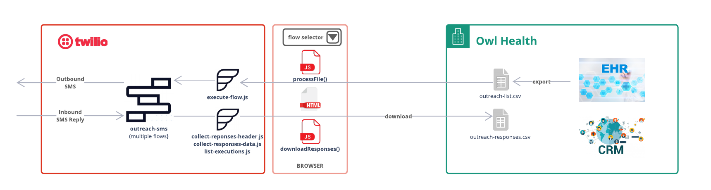

# Patient Outreach Application: Technical Guide

*This document is intended to serve as a technical guide for customers
who are interested in the installing & using the Patient Outreach application.*

*Installation of this application is supported using the latest versions of Chrome and Firefox.
Installation via Internet Explorer has not been officially tested and although issues are not expected, unforeseen problems may occur.*

- [Installation Information](#install)
- [Application Overview](#application)
- [Architecture & Components](#architecture)

## <a name="install"></a>Installation Information
***
***

This section details the requirements for a successful deployment and installation of the prototype application, including the necessary prerequisite steps, the variables that are needed to initiate installation, and the installation steps themselves.

### Prerequisites
***
The following prerequisites must be satisfied prior to installing the application.

**Twilio account**

  - Create a Twilio account by signing up [here](https://www.twilio.com/try-twilio)
  - Once the Twilio account is created,
    please note the “ACCOUNT SID” and “AUTH TOKEN”
    from the [Twilio console](https://console.twilio.com/) for use below
  - If you have multiple Twilio Projects under your account, make sure that you are logged into the Project that you want the application to be deployed to

**Twilio phone number**

- After provisioning your Twilio account,
  you will need to [purchase a phone number](https://www.twilio.com/console/phone-numbers/incoming)
  to use in the application
- Make sure the phone number is SMS enabled
- (This will be the phone number patients receive texts from)
- <em>Note: authentication is required in order to complete deployment via the application page,
  which will generate a nominal SMS charge to your connected Twilio account.
  Each authentication SMS sent will cost $0.0075,
  plus an additional $0.05 per successful authentication
  (multi-factor authentication leverages Twilio Verify).
  See Twilio SMS pricing and Twilio Verify pricing for more information.</em>
  
**Ensure unique application name**

In order to deploy correctly, it is important
that you do not have an existing Twilio Functions Service called ‘hls-outreach-sms.’
If you do, you will need to delete (or appropriately update the existing name of)
the existing functions service to ensure a conflict doesn’t occur during installation.
You can delete the existing Functions service via executing `make delete`
in the application directory `hls-outreach-sms` using a terminal or a command prompt.

**Install Twilio CLI**

The Twilio CLI and Serverless Toolkit will allow you to deploy the Twilio Functions/service needed for the application. The Twilio CLI allows you to manage your Twilio resources from your terminal or command prompt. The Serverless Toolkit is CLI tooling to help you develop locally and deploy to Twilio Runtime.

- Install [Twilio CLI](https://www.twilio.com/docs/twilio-cli/quickstart)
- Install [Twilio Serverless Toolkit](https://www.twilio.com/docs/labs/serverless-toolkit/getting-started#install-the-twilio-serverless-toolkit)

**Install Make Command**

  Check if you have ‘make’ installed by executing `make --version` and examining the output.
  If ‘make’ is not installed, please install it.
  On Mac computers, you can execute `xcode-select --install` to install.

**Install GitHub CLI**

  GitHub CLI will be used during installation to pull the project from GitHub to download the solution blueprint code.
  - Install [GitHub CLI](https://github.com/cli/cli/blob/trunk/README.md)

  
###Installation Steps
***
<em>(Installation of this application is supported on the latest versions of Chrome, Firefox, and Safari.
Installation via Internet Explorer has not been officially tested
and although issues are not expected, unforeseen problems may occur)</em>

We provide ‘Makefile’ to simplify the deployment/management of the application.
Your Twilio account credentials (ACCOUNT_SID & AUTH_TOKEN) are required to properly access Twilio resources on your behalf.

While the credentials can be re-entered every time you execute the Makefile,
you can also avoid re-entering the credentials by saving them as environment variables
by executing the following with your Twilio credentials:
```shell
export ACCOUNT_SID=your-twilio-account-sid
export AUTH_TOKEN=your-twilio-auth-token
```

**Ensure completed prerequisites** - ensure that you have completed all prerequisite steps listed above

1. Clone the GitHub project - cd to the directory where you will like to download the application. Clone the application from Twilio GitHub by running the following command:
    ```shell
    git clone https://github.com/twilio/hls-outreach-sms.git
    ```

2. Change directory to the application directory by `cd hls-outreach-sms`

3. Configure the application by executing `make configure`.
   You’ll be asked to enter the following configuration parameters.
   Alternatively, you can directly edit the `.env` file found in the application directory.
   - CUSTOMER_NAME used as the ‘sender’ name in SMS texts
   - TWILIO_PHONE_NUMBER used as the SMS sender phone number. This would be the Twilio phone number you purchased above
   - APPLICATION_PASSWORD to protect application from unauthorized access
   - ADMINISTRATOR_PHONE to receive MFA verification to access application

4. Deploy application via Serverless - to deploy the application, run `make deploy`.
   After successful deployment, you should now see the ‘hls-outreach-sms’ functions service in your Twilio Console under Functions.

5. Navigate to the application page -  in order to complete app setup, navigate to the application’s page.
   You can find your app page URL in the list of Assets created during application deployment in Terminal
   (look for the URL that ends in `index.html`)

6. Access the application - please reference the [Customer Implementation Guide](https://twilio-cms-prod.s3.amazonaws.com/documents/Patient_Outreach_App_Implementation_Guide.pdf) for detailed steps.

## <a name="application"></a>Application Overview
***
***

The 'hls-outreach-sms' app packages together the core components of a deployable prototype for SMS-based outreach.
This app aims to support healthcare providers, payors, and life sciences organizations
who are interested in building their own outreach solution to understand what is possible using Twilio,
and to accelerate the path to success by providing core building blocks and necessary workflows.
Because the concept of an outreach solution is inherently flexible and can be useful for a variety of communication needs,
the app includes three unique use case examples,
each highlighting a different scenario relevant for healthcare and life sciences organizations.

This application is not intended to be a production-ready app,
but rather will allow the installation of a functioning prototype
into a test environment for exploration of how Twilio components
and functions can be leveraged to meet various business needs.

## <a name="architecture"></a>Architecture & Components
***
***
This section provides an overview of the application's architecture,
including a discussion of the baked-in Twilio components
(which orchestrate the automated SMS conversation with the recipient),
how the CSV file is used to trigger the appropriate messages,
and a Reference Architecture showing the flow of the application.

### Architecture Overview
***
The Reference Architecture diagram below shows a more detailed description of the process and data flow between the application components.



### Application Components
***

The application's architecture consists of Twilio components,
plus file upload functionality used to specify recipient details.
Although the application can be modified to incorporate more complex integrations or capabilities,
this prototype solution has intentionally been designed with project simplicity in mind
and does not require complex 3rd party components (like cloud service provider functionality)
or integration with an electronic health record in order to function.

**Twilio Studio** implements the SMS outreach flow to the patient or recipient by taking configured parameters
(from the uploaded CSV file and from your preferred message details configured in the Studio Flow)
and sending appropriate messages.

In order to highlight the flexible nature of an outreach solution,
the application includes three distinct use-case examples, each driven by a unique Studio Flow.
You can inspect (and manipulate) these Flows in your Twilio Console after successful application deployment
(see the [Customer Implementation Guide](https://twilio-cms-prod.s3.amazonaws.com/documents/Patient_Outreach_App_Implementation_Guide.pdf) document for a more detailed discussion of how Studio Flows
can be configured to meet different business needs).

**Twilio Functions** are used to execute the SMS flow for each recipient and to collect the outreach responses
for download.

**CSV upload** is available on the application page and is used as the primary data source specifying the recipient details
(name and phone number).
The application page will allow you to choose the use-case example you would like your specific CSV file to apply to.

By having the Twilio Studio flow trigger from a CSV upload
(versus an event from an integrated EHR, for example),
this application reduces the required implementation complexity
and allows for simple and fast enablement that can meet the needs of simpler projects
that do not necessitate a more complex integration.
We imagine that in many of your production scenarios the contents of the file will come from
some source repository (like a CRM system or EHR) filtered down
to meet the specific needs of the particular outreach scenario, and exported.
There are many ways in which you can manipulate this application to fit your specific project needs,
including the type of source data that is used to trigger the Twilio workflow.
See the [Customer Implementation Guide](https://twilio-cms-prod.s3.amazonaws.com/documents/Patient_Outreach_App_Implementation_Guide.pdf) doc for more information
and examples of how the app can be manipulated to leverage a different data source
(as well as how the Twilio components can be manipulated to fit different business scenarios).

**CSV Download** is also available on the application page to download the responses of an outreach executed.
Please note that the responses are only available for the last 30 days due to Twilio log retention policy.
